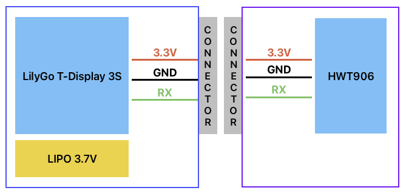

# Astro Alarm

## Presentation

Goal of the Astro Alarm :
- Include a silent alarm, connected to a Astro AlarmClient which receive notification if the mount is moved
- Provide mount angles to help during installation phase

**Astro Alarm Server** and **Astro Alarm Client** are based on the same hardware and the same software. The only difference, is the inclinometer sensor connected to the **Astro Alarm Server** but not on the **Astro Alarm Client**, and the Buzzer on the **Astro Alarm Client**.

We need this material :
- LilyGo T-Display S3
- 3.7V Lipo battery (optional)
- HWT906 sensor (**Astro Alarm Server** only)
- Buzzer (**Astro Alarm Client** only)

---
## Hardware
### Astro Alarm Server

Cable connection :
| Type | Pin  | Color |
|:----:|:----:|:-----:|
| 3.3V | 3.3V | brown |
| GND  | GND  | black |
| RX   | 18   | blue  |
### Astro Alarm Client

Buzzer connection :
| Type | Pin |
|:----:|:---:|
| +    | 16  |

---
## Arduino IDE

### Settings
**Board package** : esp32 par Espressif  
**Board** : LilyGo T-Display-S3

### Packages
You need these libraries :
- Hardware Buttons (with the IDE)
- TFT_eSPI (with IDE)
  Note : because there is a problem with the TFT library, you must replace the **User_Setup_Select.h** file in the library folder by the file provided with the Astro Alarm repo. If the livrary is updated, you must do it again.

### Programmation
If you have an error when flashing the board, just unplug USB-C, push the bottom button and plug USB-C.

---
## Arduino Software

Server or Client mode is automatically selected by the software, the software is the same for both board.

### Button usage
#### Server side
- **short push** : memory function for angular values. Will update the memory at each short push
- **long push** : remove the memory values from the screen

#### Client side
- **long push** : switch the alarm mode (on -> off | stop-alert -> on -> …)
